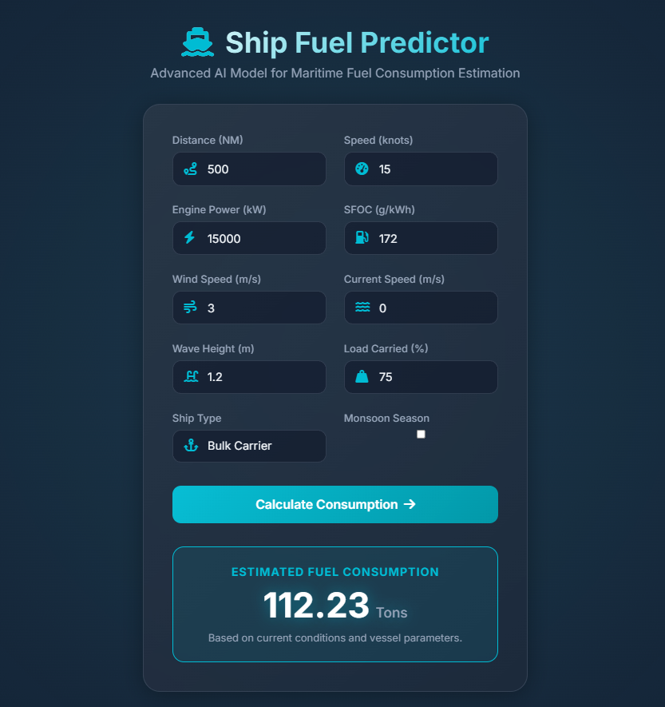

# 🚢 Ship Fuel Predictor

> **AI-Powered Maritime Fuel Efficiency Estimation**
>
> Accurately predict fuel consumption for various vessel types using advanced machine learning.

 
*(Note: You can replace this link with an actual screenshot of your running app)*

## 🌟 Features

- **Multi-Parameter Analysis**: Considers Distance, Speed, Engine Power, SFOC, Weather (Wind, Current, Waves), and Cargo Load.
- **Physics-Informed AI**: Uses a **Gradient Boosting Regressor** trained on a hybrid of synthetic data and physics-based simulations.
- **Robust for All Ranges**: 
    - Handles long-haul voyages using data-driven patterns.
    - Correctly predicts short-distance trips using **Log-Linear Modeling** (preventing negative or zero predictions).
- **Modern UI**: Dark-themed, glassmorphic design for a premium user experience.

## 🛠️ Tech Stack

- **Frontend**: HTML5, CSS3 (Glassmorphism), JavaScript (Fetch API)
- **Backend**: Python, Flask
- **ML Engine**: Scikit-Learn (Gradient Boosting), Pandas, NumPy

## 🚀 Getting Started

### Prerequisites

- Python 3.8+
- pip

### Installation

1. **Clone the repository** (or unzip the project):
   ```bash
   cd Ship_fuel_predictor
   ```

2. **Install dependencies**:
   ```bash
   pip install -r requirements.txt
   ```

3. **Run the Application**:
   ```bash
   python app.py
   ```

4. **Open in Browser**:
   Navigate to `http://127.0.0.1:5000`

## 🧠 Model Training

The model is pre-trained and saved as `fuel_model.pkl`. However, if you have new data or want to retrain:

1. Place your data in `synthetic_ship_fuel_indian_ocean.csv`.
2. Run the training script:
   ```bash
   python train_model.py
   ```
   *This script automatically:*
   - Loads the dataset.
   - **Augments** it with 2,000+ synthetic short-trip records to ensure accuracy for short distances.
   - Performs **Grid Search** for hyperparameter optimization.
   - Log-transforms the target target to ensure positive predictions.
   - Saves the best model to `fuel_model.pkl`.

## 📂 Project Structure

- `app.py`: Flask backend server.
- `train_model.py`: Training pipeline (Preprocessing, Augmentation, Training, Saving).
- `static/`: CSS and JavaScript files.
- `templates/`: HTML templates.
- `requirements.txt`: Python dependencies.

## 🤝 Contributing

Feel free to fork this project and submit pull requests. For major changes, please open an issue first to discuss what you would like to change.

---
*Built with ❤️ for Maritime Efficiency*
